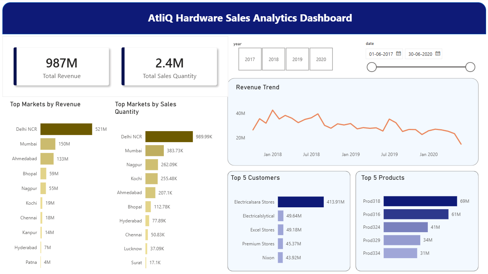
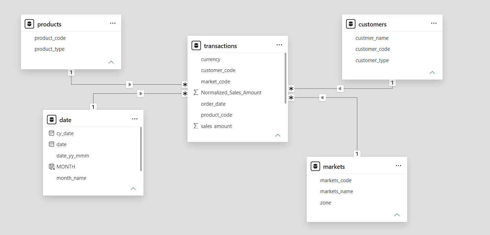

# AtliQ Hardware Sales Analytics Dashboard

An end-to-end **Business Intelligence learning project** built using **SQL and Microsoft Power BI** to analyze sales performance across markets, customers, products, and time periods.

The project demonstrates the complete BI workflow, from querying raw transactional data to transforming, modeling, analyzing, visualizing, and publishing an interactive Power BI report.

## Dashboard Preview



## Project Overview

This project is based on the sales data and business scenario of **AtliQ Hardware**.

The objective was to transform raw sales transaction data into an interactive dashboard that enables users to analyze:

* Revenue performance
* Sales quantity
* Market performance
* Customer contribution
* Product performance
* Sales trends over time

The project covers the complete Business Intelligence workflow:

**SQL Database → Data Extraction → Power Query ETL → Star Schema → DAX Measures → Power BI Dashboard → Power BI Service**

## Business Problem

The project explores how Business Intelligence tools can be used to address common sales reporting and analysis challenges.

The dashboard helps analyze:

* Overall sales performance
* Revenue across different markets
* High-performing and low-performing markets
* Sales quantity by market
* Customer-level sales performance
* Product-level performance
* Revenue and sales trends over time

The final solution consolidates sales information into a single interactive report, making it easier to explore business performance across multiple dimensions.

## Dataset Overview

The sales data contains:

| Metric       |             Details |
| ------------ | ------------------: |
| Transactions |             148,672 |
| Customers    |                  38 |
| Products     |                 279 |
| Markets      |                  15 |
| Data Period  | Oct 2017 – Jun 2020 |

The dataset was sourced from a SQL Server transactional database and includes information related to customers, products, markets, transactions, sales quantity, sales amount, and currency.

## Tools and Technologies

* **SQL Server Management Studio (SSMS)** – Data querying and analysis
* **Power BI Desktop** – Data modeling and dashboard development
* **Power Query** – Data cleaning, transformation, and ETL
* **DAX** – Measures and analytical calculations
* **Star Schema** – Data modeling
* **Bookmarks** – Interactive report navigation
* **Power BI Service** – Report publishing

## Project Workflow

### 1. SQL Data Extraction

SQL was used to explore and analyze the underlying sales database.

Key activities included:

* Retrieving relevant datasets
* Joining multiple tables
* Filtering records
* Aggregating sales information
* Analyzing market performance
* Validating data
* Investigating data quality issues

### 2. Data Transformation and ETL

Power Query was used to prepare the data for analysis.

The transformation process included:

* Removing unnecessary columns
* Handling missing and blank values
* Correcting data types
* Standardizing fields
* Transforming currency-related information
* Creating required columns
* Filtering irrelevant records
* Preparing tables for data modeling

### 3. Data Modeling

A **Star Schema** was implemented to organize the data model.

The model consists of:

**Fact Table**

* Transactions
* Sales Amount
* Sales Quantity
* Keys linking to dimension tables

**Dimension Tables**

* Customers
* Products
* Markets
* Date

This structure enables efficient filtering and analysis across different business dimensions.

### Data Model



### 4. DAX Measures

DAX was used to create dynamic measures and KPIs, including:

* Total Revenue
* Total Sales Quantity
* Revenue by Market
* Sales Quantity by Market
* Revenue by Customer
* Revenue by Product
* Revenue by Year
* Revenue by Month

Example measures:

```DAX
Total Revenue = SUM(transactions[Sales Amount])
```

```DAX
Total Quantity = SUM(transactions[Sales Quantity])
```

These measures dynamically respond to report filters and user interactions.

## Dashboard Features

The Power BI dashboard provides interactive analysis of:

* Revenue by market
* Sales quantity by market
* Customer contribution
* Product performance
* Revenue trends over time
* Market comparison
* Sales performance across different periods

Interactive features include:

* Slicers and filters
* Dynamic visuals
* KPI cards
* Bookmarks
* Report navigation

## Dashboard Highlights

Based on the dashboard analysis:

* **Total Revenue:** ₹98.67 Cr
* **Units Sold:** 24.3 Lakh
* **Markets Covered:** 15
* **Customers:** 38
* **Products:** 279
* **Top Customer:** Electricalsara Stores
* **Top Product by Revenue:** Prod040
* **Data Coverage:** October 2017 to June 2020

The analysis also enables comparison of market performance and identification of sales trends across different time periods.

## Key Business Questions Addressed

The dashboard helps answer questions such as:

* What is the total revenue generated?
* How much quantity has been sold?
* Which markets generate the highest revenue?
* Which markets contribute the highest sales quantity?
* Which customers contribute the most to revenue?
* Which products perform best?
* How does revenue change over time?
* Which markets are underperforming?
* What are the major sales trends?

## Power BI Service and Publishing

After completing the report in Power BI Desktop, it was published to **Power BI Service**.

This project demonstrates the complete workflow:

**Data → Transformation → Modeling → Analysis → Visualization → Publishing**

## Repository Structure

```text
AtliQ-Hardware-Sales-Analytics/
│
├── AtliQ_Sales_Project_Report_v2.pdf
├── Atliq_Sales_Project.pbix
├── Dashboard_Overview.png
├── Data_Model.png
└── README.md
```

## Skills Demonstrated

### Technical Skills

* SQL
* Power BI
* Power Query
* DAX
* ETL
* Data Cleaning
* Data Transformation
* Data Modeling
* Star Schema
* Data Visualization
* Power BI Service
* Report Publishing
* Bookmarks
* Interactive Dashboard Development

### Analytical Skills

* Sales Performance Analysis
* Market Analysis
* Customer Analysis
* Product Analysis
* Trend Analysis
* KPI Development
* Business Reporting
* Data-Driven Decision Making

## Project Outcome

This project demonstrates how raw transactional data can be transformed into an interactive Business Intelligence solution.

Through SQL querying, Power Query transformation, Star Schema modeling, DAX calculations, and interactive Power BI visualizations, the project provides a consolidated view of sales performance across markets, customers, products, and time periods.

As a learning project, it provided hands-on experience with the end-to-end Business Intelligence workflow and the practical application of SQL and Power BI for sales analytics.

---

## Author

**Harikrishnan V**

Business Intelligence | Data Analytics | Power BI | SQL

[LinkedIn](https://www.linkedin.com/in/harikrishnan-v-2068a02aa/)
